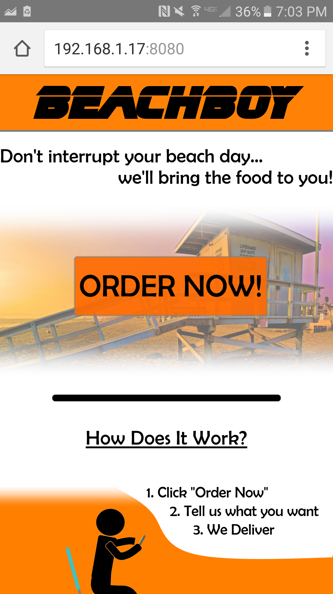
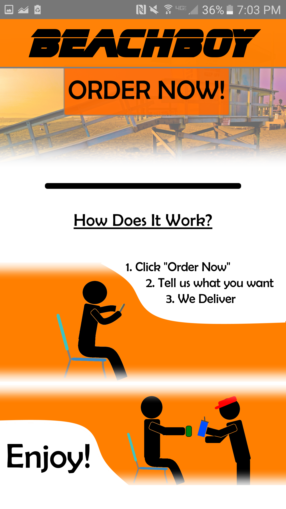

# BeachBevs
## Description
A WSS C++ server powered the beach bev website.  It managed employee login information and order details in a MySQL database.  Customers could order drinks and food from Hermosa Beach and their order and location would be shown to an employee in real-time.  It also featured a employee application system that would allow users to login and upload resumes.

## Images

